# AI Manga Localizer — Project Plan

Last updated: 2026-08-11

## Current phase

The project is in **M2 Existing-data Routing Regression**.

The engineering skeleton and M1 bubble-mask adapter are established, several real local routes have been exercised, and a private 50-page AI-assisted `review-v5` set is available as a working gold set. M2 has completed both the offline bbox replay and a read-only live scene replay without rerunning detection, OCR, translation, or rendering. The Koharu 0.61.2 production route has no effective `linePolygons`, so polygon threshold validation is explicitly unavailable rather than represented by bbox fallback results.

This document is the public, repository-level source of truth for project direction. Private images, OCR text, translations, prompts, model files, and review data remain outside Git. Aggregate measurements may be recorded here when they do not expose private content.

## Product goal

Build a local-first Japanese manga to Simplified Chinese quality orchestrator that approaches careful personal scanlation quality while preserving editable project output and failing closed when automation could damage the page.

V1 remains focused on:

- personal, non-commercial, local use;
- image directories, ZIP, and CBZ input;
- Simplified Chinese output;
- ordinary dialogue and narration replacement;
- preservation-first handling of large artistic sound effects;
- rendered images, CBZ, KHR, report, and optional PSD output;
- an RTX 4060 Laptop GPU with 8 GB VRAM as the reference machine.

Hosted services, accounts, payments, public content distribution, and PDF input are outside V1.

## Evidence available today

### Working gold

The private `review-v5` set contains 50 pages and 388 reviewed regions. It has received page-by-page AI visual review, OCR candidate comparison, Japanese correction, reference translation, and layout assessment.

For current personal research it is a **working gold** suitable for:

- comparing candidate routes;
- counting error types;
- extracting hard cases;
- module-level analysis;
- selecting a V1 architecture.

It is not a final professional benchmark validated by multiple independent human reviewers. Ambiguous or decision-critical samples may receive targeted human spot checks later; a full 50-page relabel is not a prerequisite for V1 selection.

### Verified local runs

The following evidence has been observed locally:

- Koharu 0.61.2 is installed and has completed real local runs.
- A three-page GPU safety regression verified successful rendering and byte-identical preservation of protected pages.
- One 50-page Koharu candidate baseline completed with editable and rendered artifacts.
- PaddleOCR-VL 1.6 and Manga OCR candidates were both captured for the baseline.
- A Sakura-family model produced the only complete 50-page translation baseline so far.
- Murasaki-8B-v0.2 IQ4_XS has been tested through multiple integration routes, but no Murasaki route has yet produced a complete, competitive controlled baseline.
- MangaTranslator integration can partially render pages, but current smoke results do not justify adopting it as the V1 chassis.
- A real Koharu scene probe verified that speech-bubble segmentation is persisted as page-sized, integer-labelled `role=bubble` WebP masks.

### Baseline measurements

The 50-page working-gold comparison currently shows:

| Measurement | Observed baseline |
| --- | ---: |
| Detection recall | 387 / 388 (99.74%) |
| Selected OCR regions at CER <= 3% | 80.41% |
| Semantically usable translations | 240 / 388 (61.86%) |
| Layout pass | 271 / 388 (69.85%) |
| Strict no-edit pages | 3 / 50 (6%) |
| Mean repair and lettering score | 2.84 / 5 |

These are diagnostic measurements, not release claims.

The current deterministic QA detected only 31 of 148 semantic failures. It is useful for malformed output, residual Japanese, length anomalies, token loss, overflow risk, and related structural checks, but it is not a semantic judge.

### OCR evidence

Raw confidence comparison is not a valid cross-model selector. In the current baseline it selected Manga OCR for every available region even though the engines have different failure profiles.

| OCR engine | Exact-region rate | Corpus CER |
| --- | ---: | ---: |
| PaddleOCR-VL 1.6 | 75.13% | 5.22% |
| Manga OCR | 80.62% | 21.54% |

Manga OCR performs well on many ordinary, dense, and stylized regions but has severe long-tail errors on dark-complex and structural-negative pages. PaddleOCR-VL is more robust on those page classes. The evidence supports a calibrated or type-aware selector, not a single universal engine and not direct raw-confidence comparison.

### Bubble-mask evidence

A three-page Koharu 0.61.2 live probe found:

- 42 text nodes;
- one `role=bubble` mask and one `role=segment` mask per page;
- no direct `insideBubble`, `regionType`, `semanticRole`, panel, or relation fields;
- bubble masks with the same dimensions as their pages;
- label value `0` for background and non-zero integer labels consistent with distinct bubble instances;
- text-region bubble hits of 10/10, 1/5, and 5/27 across the three pages.

The follow-up 50-page live scene probe found 387 text nodes and 387 null `linePolygons` fields. The real adapter route therefore used transform bboxes for all 387 detected nodes. Koharu 0.61.2 Anime Text, Comic Text Detector, Comic Text & Bubble Detector, and PP-DocLayout were also verified not to populate effective non-empty `linePolygons` on text nodes. No detection-only run is needed or planned because it would not validate a geometry route that these engines do not produce.

Koharu therefore provides native bubble-mask evidence, and the M1 adapter now consumes it with explicit geometry provenance. M2 verifies that `unknown -> replace` is no longer the default because unidentified artistic or structural text must not be erased.

### Existing-data routing regression

The M2 offline replay associated the existing 50-page KHR with review-v5 by serialized page UUID and content-addressed mask references. Each page had two page-sized label masks. The first multi-instance slot was treated as the bubble mask and the second binary slot as the segment mask. This inference reproduced the prior three-page live probe exactly: 10/10, 1/5, and 5/27 bubble hits.

Using thresholds of 0.80 for inside-bubble and 0.05 for outside-bubble, the Koharu 0.61.2 bbox production-route replay found:

| Measurement | Detected regions | All reviewed regions |
| --- | ---: | ---: |
| Bubble-contained ordinary dialogue | 317 / 387 (81.91%) | 317 / 388 (81.70%) |
| Bubble-external text | 70 / 387 (18.09%) | 71 / 388 (18.30%) |
| Geometrically uncertain | 0 / 387 (0%) | 0 / 388 (0%) |
| `unknown -> replace` violations | 0 | 0 |

All 70 detected bubble-external regions now resolve to runtime role `unknown` with `preserve-with-annotation`; the 317 bubble-contained regions resolve to `dialogue` with `replace`. The legacy manifest had all 387 detected regions as `unknown + replace`. Unknown regions occur on 17 pages, and the current render-safety gate preserves those pages before inpainting or rendering; the one zero-detection page is separately preserved, leaving 32/50 pages free of the unknown-or-empty role gate before other QA checks. Across detected regions, outside-bubble overlap had a maximum of 0, while mapped dialogue had a minimum overlap of 0.970428 and minimum dominant-label share of 0.9980. The live replay again produced mapped 317, external 70, geometric unknown 0, and `unknown -> replace` violations 0.

The 0.80/0.05 thresholds are frozen only for the Koharu 0.61.2 bbox production route. The `line-polygons` route is unavailable and unvalidated, so no polygon threshold is frozen. Versioned routing reports count `line-polygons` and bbox evidence separately and expose a strict polygon gate; all-bbox data receives `reasonCode = "LINE_POLYGONS_UNAVAILABLE"` and is not freeze-eligible. Mixed or incomplete geometry data is also not a polygon-only result; only all-polygon evidence across detected observations can pass the polygon gate.

The detected distribution by page stratum was:

| Stratum | Bubble-contained | Bubble-external | Geometric unknown |
| --- | ---: | ---: | ---: |
| ordinary-dialogue | 130 | 4 | 0 |
| dense-text | 84 | 9 | 0 |
| dark-complex | 40 | 12 | 0 |
| artistic-sfx-action | 57 | 6 | 0 |
| structural-negative | 6 | 39 | 0 |

A seven-region private hard-case set now covers one detected bubble-external example from every stratum, the single missed artistic-text region, and one bubble-mapped region on a structural-negative page. It contains stable IDs and numeric evidence only; no image, OCR text, translation, prompt, or blob identifier is recorded.

Current decision: deterministic bubble geometry is sufficient for preservation-first safety on the validated bbox production route, but not for useful coverage by itself because the conservative unknown gate blocks 17 mixed-content pages. It is not sufficient to infer the semantic subtype of bubble-external text, so external text remains unknown and preserved. No classifier should be added until the seven hard cases receive a targeted visual role spot check. The polygon route remains unavailable and is not a reason to schedule detection-only work.

## Architecture decisions

### Decisions that can be frozen provisionally

- **Koharu remains the V1 chassis.** It owns detection, scene storage, inpainting, rendering, editing, and project export.
- **This repository remains the quality orchestrator.** It owns routing, OCR arbitration, chapter context, QA, benchmarking, privacy, and recovery policy.
- **The V1 pipeline is hybrid.** Evidence does not support replacing Koharu wholesale with MangaTranslator or adopting a single monolithic route.
- **The private `review-v5` set is the current working gold.** It is sufficient for V1 research but not for final public quality claims.
- **Models load sequentially.** The observed 8 GB environment does not have enough headroom for competing large models to remain loaded together.
- **Safety, privacy, archive validation, unique output directories, recovery artifacts, and source-page preservation remain hard requirements.**
- **Unknown region roles fail closed.** Unknown content is preserved or routed to review; it is never erased merely because classification is missing.

### Decisions that remain open

- the calibrated OCR selector and whether a manga-specialized Paddle candidate adds value;
- the default translation model, quantization, prompt mode, and retry/reviewer policy;
- AOT versus LaMa as the default repair path;
- thresholds for residual-text, mask-boundary, and outside-mask visual QA;
- whether additional discourse, speaker, character, or panel fields are justified by real error categories;
- final release-quality thresholds after representative end-to-end runs.

### Approaches rejected or deferred for now

- full relabelling of all 50 working-gold pages before V1 selection;
- direct comparison of raw OCR confidences across engines;
- `unknown -> replace` routing;
- freezing a model because it is already present in configuration;
- treating a partial smoke as evidence of route superiority;
- adding speaker-aware, character-aware, or multi-model semantic machinery before real errors demonstrate that it is a primary bottleneck;
- turning visual QA warnings into an automatic release gate before calibration on real images;
- scheduling detection-only work to seek `linePolygons` from Koharu 0.61.2 engines already verified not to populate them.

## Target V1 pipeline

```mermaid
flowchart LR
    A["Safe import"] --> B["Koharu detection and scene"]
    B --> C["Role and page policy router"]
    B --> D["Bubble and segment masks"]
    D --> C
    C --> E["OCR candidates"]
    E --> F["Calibrated OCR arbitration"]
    F --> G["Chapter context and controlled glossary"]
    G --> H["Replaceable translation model"]
    H --> I["Deterministic QA and targeted retry"]
    I --> J["Koharu inpainting and typesetting"]
    J --> K["Report-first visual QA"]
    K --> L["Images, CBZ, KHR, report, optional PSD"]
```

The router must distinguish evidence provenance:

- `nativeRoleEvidence`: a native Koharu field, typed node, or mask role;
- `derivedRoleEvidence`: mask overlap, geometry, typography, or another deterministic inference;
- `roleConfidence`: a calibrated confidence for the derived decision;
- `roleProvenance`: the exact rule or model that produced the decision;
- `geometrySource`: `line-polygons` or bbox geometry used for the bubble-mask measurement, kept separate from role provenance;
- `bubbleInstanceId`: the non-zero label shared by text regions in the same bubble.

High-confidence bubble-contained text may be treated as dialogue. Bubble-external text is not automatically a sound effect; it remains unknown until a separate rule has adequate evidence.

## Milestones

### M0 — Evidence synthesis

Status: **complete**

Completion evidence:

- working-gold status and limitations documented;
- existing Koharu, OCR, translation, MangaTranslator, safety, and visual evidence compared;
- module-level bottlenecks separated;
- V1 chassis and open component slots identified;
- bubble scene contract resolved through a real API probe.

### M1 — Bubble-mask scene adapter

Status: **complete and committed; unit, mocked contract, CLI, dependency, privacy, and adversarial checks passed; polygon calibration is unavailable on the verified Koharu 0.61.2 routes**

Scope:

- bounded local blob retrieval from Koharu;
- in-memory lossless WebP mask decoding;
- page-coordinate validation;
- text polygon or box overlap with integer bubble labels;
- `insideBubble`, `bubbleInstanceId`, confidence, role provenance, and geometry-source records;
- preservation-first policy for unknown roles;
- schema and contract tests;
- malformed image, dimension mismatch, oversized input, coordinate, privacy, and failure-closed tests.

Completion gate:

- all unit and mocked contract tests pass;
- CLI syntax check passes;
- dependency and license changes are reviewed;
- no source or translated text, blob identifiers, images, or prompts enter logs;
- no claim of real quality is made before the next milestone.

Estimated work: one focused implementation and review task.

### M2 — Existing-data routing regression

Status: **bbox production-route regression and live geometry probe complete; seven-case visual role check remains before M3; `line-polygons` is unavailable and unvalidated**

Use existing KHR and working-gold artifacts without rerunning detection, OCR, or translation models where possible.

Goals:

- measure bubble mapping coverage on the 50-page baseline;
- quantify ordinary dialogue, bubble-external text, and uncertain regions;
- verify that unknown regions no longer enter destructive replacement;
- extract the smallest set of unresolved role hard cases;
- decide whether deterministic geometry and typography are sufficient before adding a classifier.

Completed M2 evidence:

- 317/387 detected regions map to a bubble instance and 70/387 are deterministically bubble-external;
- all 387 detected regions fall outside the uncertainty band under stored bbox geometry;
- all 70 runtime unknown regions are preserved and zero enter replacement;
- those unknowns trigger page preservation on 17/50 pages, while one additional zero-detection page is preserved separately;
- a seven-region private hard-case set covers the unresolved semantic role classes;
- prior three-page live-probe signatures are reproduced exactly without starting Koharu;
- the 50-page live replay produced mapped 317, external 70, geometric unknown 0, and `unknown -> replace` violations 0;
- all 387 live text nodes had null `linePolygons`, so all effective geometry was bbox provenance;
- mapped bbox overlap had a minimum of 0.970428 and external bbox overlap had a maximum of 0;
- 0.80/0.05 is frozen only for the Koharu 0.61.2 bbox production route;
- the strict polygon gate is not freeze-eligible when effective non-empty `linePolygons` are absent.

Remaining completion gate:

- visually verify the semantic roles of the seven hard cases, then proceed to M3 without a detection-only run.

Estimated work: one targeted visual role check.

### M3 — OCR arbitration

Status: **pending**

Goals:

- retain PaddleOCR-VL and Manga OCR candidates;
- replace raw-confidence comparison with benchmark-calibrated selection;
- accept engine agreement directly and arbitrate meaningful disagreements;
- use page or region type where it materially improves results;
- evaluate a manga-specialized Paddle candidate only on the same crops and only after separate download authorization;
- freeze thresholds only when they improve the working-gold result without worsening structural-negative safety.

Estimated work: one offline scoring task and, only if justified, one candidate-model task.

### M4 — Controlled translation selection

Status: **pending**

Use fixed working-gold OCR so that OCR and rendering failures cannot distort model comparison.

Start with a compact challenge set containing clean-OCR semantic failures and stratified successful controls. Compare the existing complete baseline with viable local candidates under the same context, glossary, formatting, and non-refusal checks. Expand to all 388 regions only when the compact result is close enough to affect the decision.

Goals:

- select the default translation model and prompt mode;
- separate OCR-caused failures from translation-caused failures;
- measure rejection, dilution, repetition, formatting, terminology, and context errors;
- decide whether a conditional semantic reviewer improves enough cases to justify its cost;
- lock model identity, quantization, license, and SHA-256 only after the hard gates pass.

Estimated work: one compact local benchmark task and, if necessary, one full text-only benchmark task.

### M5 — Repair, lettering, and visual QA

Status: **pending**

Use a stratified ten-page set before any full-chapter visual rerun.

Goals:

- compare the viable repair paths on identical masks;
- measure outside-mask pixel changes and boundary damage;
- detect residual source text without modifying unrelated artwork;
- evaluate overflow, font fallback, line breaking, and small-note placement;
- calibrate visual checks as report-only signals before making any of them release gates.

Estimated work: one GPU experiment task and one visual review task.

### M6 — V1 freeze and chapter acceptance

Status: **pending**

Goals:

- freeze the chosen engines, models, thresholds, quantizations, and hashes;
- run the three-page safety smoke again;
- process one complete representative chapter on the reference 8 GB GPU;
- record peak VRAM, page time, failure recovery, and quality metrics;
- perform an adversarial review of data loss, privacy, archive safety, routing, model failure, visual damage, and evidence claims;
- update public documentation to match only the results actually achieved.

Estimated work: one full integration task, followed by one independent review task.

## V1 acceptance targets

These remain targets, not achieved results:

- ordinary dialogue and narration detection recall at least 98%;
- printed-dialogue OCR CER no higher than 3%;
- at least 90% of translations require no semantic rewrite;
- chapter names and terminology at least 99% consistent;
- no unplanned Japanese residuals outside the deliberate artistic-text policy;
- no text overflow in accepted output;
- at least 85% of pages require no manual correction for personal reading;
- repair and lettering blind-review average at least 4/5;
- a complete representative chapter finishes on the reference 8 GB GPU without OOM;
- no comic content leaves the machine unless the user explicitly enables and configures the text-only cloud fallback for that run.

## Experiment policy

- Prefer existing artifacts and offline replay before rerunning models.
- Test the smallest decision-changing hard set before a full benchmark.
- Change one module at a time so that gains and regressions remain attributable.
- Run only one large local model at a time.
- Record model version, quantization, license, and SHA-256 with every candidate result.
- Treat synthetic tests, smoke runs, real runs, visual review, and formal acceptance as different evidence levels.
- Do not promote a self-reported model benchmark to a project decision without a controlled local comparison.
- Do not turn AI-assisted working-gold judgments into public professional-quality claims.

## Public and private boundary

The repository may contain:

- source code, schemas, tests, prompts that are safe to publish, and aggregate measurements;
- synthetic fixtures that contain no private manga content;
- model identities, licenses, quantizations, and hashes;
- architecture decisions and unexecuted-test disclosures.

The repository must not contain:

- manga pages or crops;
- private OCR text, translations, review rationales, or working-gold records;
- model weights, fonts, KHR/PSD/CBZ output, API keys, or provider secrets;
- local absolute paths or user-specific environment details;
- logs containing source text, translated text, images, blob identifiers, or prompts.

## Working method

- Keep this plan in the primary project task; implementation tasks execute one milestone at a time.
- Before each milestone, inspect Git status and protect unrelated work.
- Do not combine optional refactors with evidence-driven changes.
- Run the smallest relevant verification first, then expand only when failures or coupling justify it.
- Do not commit or push until the milestone diff and verification results have been reviewed by the user.
- Create a repository skill only after the benchmark workflow is stable and has passed representative runs.

## Immediate next actions

1. Visually spot-check the seven private role hard cases before considering an external-text classifier.
2. Record only aggregate role conclusions in public artifacts; do not expose private case identifiers or content.
3. Proceed to M3 OCR arbitration after the targeted role check; do not schedule detection-only or claim polygon validation.
