# AI Manga Localizer — Project Plan

Last updated: 2026-08-15

## Current phase

The project is in **M4.0/M4.1 Offline Translation Benchmark Contract**.

The engineering skeleton, M1 bubble-mask adapter, M2 routing regression, and category-free M3 OCR runtime contract are established. M3.10A has materialized and verified the real composite shadow. M3.10B resource-policy v2.1 is at `EXECUTABLE_NOT_RUN`; the real three-page owned-process smoke remains deliberately deferred. M4.0/M4.1 now provides a fixed-working-gold, versioned offline translation benchmark contract and a preregistered compact challenge, without starting Koharu, a model server, a model, or the GPU.

This document is the public, repository-level source of truth for project direction. Private images, OCR text, translations, prompts, model files, and review data remain outside Git. Aggregate measurements may be recorded here when they do not expose private content.

## Product goal

Build a local-first Japanese manga to Simplified Chinese quality orchestrator that approaches careful personal scanlation quality while preserving editable project output and failing closed when automation could damage the page.

V1 remains focused on:

- personal, non-commercial, local use;
- image directories, ZIP, and CBZ input;
- Simplified Chinese output;
- ordinary dialogue and narration replacement;
- preservation-first handling of large artistic sound effects;
- rendered images, CBZ, KHR, report, and optional PSD output;
- an RTX 4060 Laptop GPU with 8 GB VRAM as the reference machine.

Hosted services, accounts, payments, public content distribution, and PDF input are outside V1.

## Evidence available today

### Working gold

The private `review-v5` set contains 50 pages and 388 reviewed regions. It has received page-by-page AI visual review, OCR candidate comparison, Japanese correction, reference translation, and layout assessment.

For current personal research it is a **working gold** suitable for:

- comparing candidate routes;
- counting error types;
- extracting hard cases;
- module-level analysis;
- selecting a V1 architecture.

It is not a final professional benchmark validated by multiple independent human reviewers. Ambiguous or decision-critical samples may receive targeted human spot checks later; a full 50-page relabel is not a prerequisite for V1 selection.

### Verified local runs

The following evidence has been observed locally:

- Koharu 0.61.2 is installed and has completed real local runs.
- A three-page GPU safety regression verified successful rendering and byte-identical preservation of protected pages.
- One 50-page Koharu candidate baseline completed with editable and rendered artifacts.
- PaddleOCR-VL 1.6 and Manga OCR candidates were both captured for the baseline.
- A Sakura-family model produced the only complete 50-page historical E2E translation baseline so far; it used legacy OCR inputs and is not a fixed-working-gold OCR model score.
- Murasaki-8B-v0.2 IQ4_XS has been tested through multiple integration routes, but no Murasaki route has yet produced a complete, competitive controlled baseline.
- MangaTranslator integration can partially render pages, but current smoke results do not justify adopting it as the V1 chassis.
- A real Koharu scene probe verified that speech-bubble segmentation is persisted as page-sized, integer-labelled `role=bubble` WebP masks.

### Baseline measurements

The 50-page working-gold comparison currently shows:

| Measurement | Observed baseline |
| --- | ---: |
| Detection recall | 387 / 388 (99.74%) |
| Selected OCR regions at CER <= 3% | 80.41% |
| Historical E2E semantic usability under mixed OCR inputs | 240 / 388 (61.86%) |
| Historical E2E terminology correctness under mixed OCR inputs | 240 / 388 (61.86%) |
| Historical E2E layout usability under mixed OCR inputs | 271 / 388 (69.85%) |
| Strict no-edit pages | 3 / 50 (6%) |
| Mean repair and lettering score | 2.84 / 5 |
| Repair and lettering page-score distribution | 1: 3, 2: 11, 3: 27, 4: 9 |

These are diagnostic measurements, not release claims.

The current deterministic QA detected only 31 of 148 semantic failures. It is useful for malformed output, residual Japanese, length anomalies, token loss, overflow risk, and related structural checks, but it is not a semantic judge.

### OCR evidence

Raw confidence comparison is not a valid cross-model selector. In the current baseline it selected Manga OCR for every available region even though the engines have different failure profiles.

| OCR engine | Available / eligible | Exact among available | Corpus CER among available | Coverage-adjusted CER |
| --- | ---: | ---: | ---: | ---: |
| PaddleOCR-VL 1.6 | 383 / 384 | 289 / 383 (75.46%) | 300 / 5,772 (5.20%) | 327 / 5,799 (5.64%) |
| Manga OCR | 384 / 384 | 311 / 384 (80.99%) | 1,241 / 5,799 (21.40%) | 1,241 / 5,799 (21.40%) |

Manga OCR performs well on many ordinary, dense, and stylized regions but has severe long-tail errors on dark-complex and structural-negative pages. PaddleOCR-VL is more robust on those page classes. The evidence supports a calibrated or type-aware selector, not a single universal engine and not direct raw-confidence comparison.

### Bubble-mask evidence

A three-page Koharu 0.61.2 live probe found:

- 42 text nodes;
- one `role=bubble` mask and one `role=segment` mask per page;
- no direct `insideBubble`, `regionType`, `semanticRole`, panel, or relation fields;
- bubble masks with the same dimensions as their pages;
- label value `0` for background and non-zero integer labels consistent with distinct bubble instances;
- text-region bubble hits of 10/10, 1/5, and 5/27 across the three pages.

The follow-up 50-page live scene probe found 387 text nodes and 387 null `linePolygons` fields. The real adapter route therefore used transform bboxes for all 387 detected nodes. Koharu 0.61.2 Anime Text, Comic Text Detector, Comic Text & Bubble Detector, and PP-DocLayout were also verified not to populate effective non-empty `linePolygons` on text nodes. No detection-only run is needed or planned because it would not validate a geometry route that these engines do not produce.

Koharu therefore provides native bubble-mask evidence, and the M1 adapter now consumes it with explicit geometry provenance. M2 verifies that `unknown -> replace` is no longer the default because unidentified artistic or structural text must not be erased.

### Existing-data routing regression

The M2 offline replay associated the existing 50-page KHR with review-v5 by serialized page UUID and content-addressed mask references. Each page had two page-sized label masks. The first multi-instance slot was treated as the bubble mask and the second binary slot as the segment mask. This inference reproduced the prior three-page live probe exactly: 10/10, 1/5, and 5/27 bubble hits.

Using thresholds of 0.80 for inside-bubble and 0.05 for outside-bubble, the Koharu 0.61.2 bbox production-route replay found:

| Measurement | Detected regions | All reviewed regions |
| --- | ---: | ---: |
| Bubble-contained ordinary dialogue | 317 / 387 (81.91%) | 317 / 388 (81.70%) |
| Bubble-external text | 70 / 387 (18.09%) | 71 / 388 (18.30%) |
| Geometrically uncertain | 0 / 387 (0%) | 0 / 388 (0%) |
| `unknown -> replace` violations | 0 | 0 |

All 70 detected bubble-external regions now resolve to runtime role `unknown` with `preserve-with-annotation`; the 317 bubble-contained regions resolve to `dialogue` with `replace`. The legacy manifest had all 387 detected regions as `unknown + replace`. Unknown regions occur on 17 pages, and the current render-safety gate preserves those pages before inpainting or rendering; the one zero-detection page is separately preserved, leaving 32/50 pages free of the unknown-or-empty role gate before other QA checks. Across detected regions, outside-bubble overlap had a maximum of 0, while mapped dialogue had a minimum overlap of 0.970428 and minimum dominant-label share of 0.9980. The live replay again produced mapped 317, external 70, geometric unknown 0, and `unknown -> replace` violations 0.

The 0.80/0.05 thresholds are frozen only for the Koharu 0.61.2 bbox production route. The `line-polygons` route is unavailable and unvalidated, so no polygon threshold is frozen. Versioned routing reports count `line-polygons` and bbox evidence separately and expose a strict polygon gate; all-bbox data receives `reasonCode = "LINE_POLYGONS_UNAVAILABLE"` and is not freeze-eligible. Mixed or incomplete geometry data is also not a polygon-only result; only all-polygon evidence across detected observations can pass the polygon gate.

The detected distribution by page stratum was:

| Stratum | Bubble-contained | Bubble-external | Geometric unknown |
| --- | ---: | ---: | ---: |
| ordinary-dialogue | 130 | 4 | 0 |
| dense-text | 84 | 9 | 0 |
| dark-complex | 40 | 12 | 0 |
| artistic-sfx-action | 57 | 6 | 0 |
| structural-negative | 6 | 39 | 0 |

A seven-region private hard-case set now covers one detected bubble-external example from every stratum, the single missed artistic-text region, and one bubble-mapped region on a structural-negative page. It contains stable IDs and numeric evidence only; no image, OCR text, translation, prompt, or blob identifier is recorded.

Current decision: deterministic bubble geometry is sufficient for preservation-first safety on the validated bbox production route, but not for useful coverage by itself because the conservative unknown gate blocks 17 mixed-content pages. The targeted seven-case visual role check found no destructive replacement errors and supported keeping the 0.80/0.05 bbox thresholds unchanged. It also confirmed that bubble-external text contains multiple semantic roles, including replaceable captions or monologue as well as artistic or decorative text that must remain preserved. Geometry alone therefore cannot classify the subtype: external text remains unknown and preserved until separate evidence justifies a classifier. The polygon route remains unavailable and is not a reason to schedule detection-only work.

## Architecture decisions

### Decisions that can be frozen provisionally

- **Koharu remains the V1 chassis.** It owns detection, scene storage, inpainting, rendering, editing, and project export.
- **This repository remains the quality orchestrator.** It owns routing, OCR arbitration, chapter context, QA, benchmarking, privacy, and recovery policy.
- **The V1 pipeline is hybrid.** Evidence does not support replacing Koharu wholesale with MangaTranslator or adopting a single monolithic route.
- **The private `review-v5` set is the current working gold.** It is sufficient for V1 research but not for final public quality claims.
- **Models load sequentially.** The observed 8 GB environment does not have enough headroom for competing large models to remain loaded together.
- **Safety, privacy, archive validation, unique output directories, recovery artifacts, and source-page preservation remain hard requirements.**
- **Unknown region roles fail closed.** Unknown content is preserved or routed to review; it is never erased merely because classification is missing.

### Decisions that remain open

- the calibrated OCR selector and whether a manga-specialized Paddle candidate adds value;
- the default translation model, quantization, prompt mode, and retry/reviewer policy;
- AOT versus LaMa as the default repair path;
- thresholds for residual-text, mask-boundary, and outside-mask visual QA;
- whether additional discourse, speaker, character, or panel fields are justified by real error categories;
- final release-quality thresholds after representative end-to-end runs.

### Approaches rejected or deferred for now

- full relabelling of all 50 working-gold pages before V1 selection;
- direct comparison of raw OCR confidences across engines;
- `unknown -> replace` routing;
- freezing a model because it is already present in configuration;
- treating a partial smoke as evidence of route superiority;
- adding speaker-aware, character-aware, or multi-model semantic machinery before real errors demonstrate that it is a primary bottleneck;
- turning visual QA warnings into an automatic release gate before calibration on real images;
- scheduling detection-only work to seek `linePolygons` from Koharu 0.61.2 engines already verified not to populate them.

## Target V1 pipeline

```mermaid
flowchart LR
    A["Safe import"] --> B["Koharu detection and scene"]
    B --> C["Role and page policy router"]
    B --> D["Bubble and segment masks"]
    D --> C
    C --> E["OCR candidates"]
    E --> F["Calibrated OCR arbitration"]
    F --> G["Chapter context and controlled glossary"]
    G --> H["Replaceable translation model"]
    H --> I["Deterministic QA and targeted retry"]
    I --> J["Koharu inpainting and typesetting"]
    J --> K["Report-first visual QA"]
    K --> L["Images, CBZ, KHR, report, optional PSD"]
```

The router must distinguish evidence provenance:

- `nativeRoleEvidence`: a native Koharu field, typed node, or mask role;
- `derivedRoleEvidence`: mask overlap, geometry, typography, or another deterministic inference;
- `roleConfidence`: a calibrated confidence for the derived decision;
- `roleProvenance`: the exact rule or model that produced the decision;
- `geometrySource`: `line-polygons` or bbox geometry used for the bubble-mask measurement, kept separate from role provenance;
- `bubbleInstanceId`: the non-zero label shared by text regions in the same bubble.

High-confidence bubble-contained text may be treated as dialogue. Bubble-external text is not automatically a sound effect; it remains unknown until a separate rule has adequate evidence.

## Milestones

### M0 — Evidence synthesis

Status: **complete**

Completion evidence:

- working-gold status and limitations documented;
- existing Koharu, OCR, translation, MangaTranslator, safety, and visual evidence compared;
- module-level bottlenecks separated;
- V1 chassis and open component slots identified;
- bubble scene contract resolved through a real API probe.

### M1 — Bubble-mask scene adapter

Status: **complete and committed; unit, mocked contract, CLI, dependency, privacy, and adversarial checks passed; polygon calibration is unavailable on the verified Koharu 0.61.2 routes**

Scope:

- bounded local blob retrieval from Koharu;
- in-memory lossless WebP mask decoding;
- page-coordinate validation;
- text polygon or box overlap with integer bubble labels;
- `insideBubble`, `bubbleInstanceId`, confidence, role provenance, and geometry-source records;
- preservation-first policy for unknown roles;
- schema and contract tests;
- malformed image, dimension mismatch, oversized input, coordinate, privacy, and failure-closed tests.

Completion gate:

- all unit and mocked contract tests pass;
- CLI syntax check passes;
- dependency and license changes are reviewed;
- no source or translated text, blob identifiers, images, or prompts enter logs;
- no claim of real quality is made before the next milestone.

Estimated work: one focused implementation and review task.

### M2 — Existing-data routing regression

Status: **complete; bbox production-route regression, live geometry probe, and seven-case visual role check passed; `line-polygons` remains unavailable and unvalidated**

Use existing KHR and working-gold artifacts without rerunning detection, OCR, or translation models where possible.

Goals:

- measure bubble mapping coverage on the 50-page baseline;
- quantify ordinary dialogue, bubble-external text, and uncertain regions;
- verify that unknown regions no longer enter destructive replacement;
- extract the smallest set of unresolved role hard cases;
- decide whether deterministic geometry and typography are sufficient before adding a classifier.

Completed M2 evidence:

- 317/387 detected regions map to a bubble instance and 70/387 are deterministically bubble-external;
- all 387 detected regions fall outside the uncertainty band under stored bbox geometry;
- all 70 runtime unknown regions are preserved and zero enter replacement;
- those unknowns trigger page preservation on 17/50 pages, while one additional zero-detection page is preserved separately;
- a seven-region private hard-case set covers the unresolved semantic role classes;
- prior three-page live-probe signatures are reproduced exactly without starting Koharu;
- the 50-page live replay produced mapped 317, external 70, geometric unknown 0, and `unknown -> replace` violations 0;
- all 387 live text nodes had null `linePolygons`, so all effective geometry was bbox provenance;
- mapped bbox overlap had a minimum of 0.970428 and external bbox overlap had a maximum of 0;
- 0.80/0.05 is frozen only for the Koharu 0.61.2 bbox production route;
- the strict polygon gate is not freeze-eligible when effective non-empty `linePolygons` are absent;
- the seven-case visual role check found no destructive replacement errors and no evidence supporting a bbox threshold change;
- conservative false preservation remains for some replaceable external captions or monologue, while artistic, decorative, and missed text remains protected;
- bubble-external semantic classification remains open, but it does not block proceeding to OCR arbitration while the fail-closed preservation policy remains in force.

Completion gate:

- visually verify the semantic roles of the seven hard cases without a detection-only run: **passed**;
- verify that no unsafe `unknown -> replace` path or destructive hard-case replacement remains: **passed**;
- keep unresolved external semantic roles fail-closed and explicitly out of the frozen routing claim: **passed**.

Estimated work: one targeted visual role check.

### M3 — OCR arbitration

Status: **M3.10A real composite shadow build verified; M3.10B resource-policy v2.1 is `EXECUTABLE_NOT_RUN`; the real three-page Koharu smoke is deferred**

M3.1a evidence:

- `review-v5` remains unchanged; the five accepted visual-audit decisions are represented only by an ignored, versioned private overlay pinned to the exact base hash and byte length;
- the fixed benchmark population is 388 working-gold regions: 387 detector outputs and one detection miss;
- OCR scoring contains 384 eligible detected regions, excludes three detected structural or boundary cases, and has 383 regions with both retained candidates;
- derived input and aggregate baseline report are private ignored artifacts; public schemas and synthetic fixtures contain no private manga text, page identifiers, or real region identifiers;
- normalization is NFKC followed by whitespace removal; exact match and character edit distance use the normalized text, missing candidates remain explicit, and no cross-engine raw confidence is consumed;
- M3.2 implemented offline comparison against this contract without rerunning a model. It did not establish a calibrated arbitration policy.

M3.2 outcome:

- the fixed M3.1a benchmark input, its baseline report, and the final M2 routing observations are SHA-256 pinned and joined one-to-one across all 388 reviewed regions;
- leave-one-page-out evaluation uses 50 page folds, with 49 pages containing OCR-eligible regions; training and held-page evaluation never share a page;
- the two predeclared adaptive strategies both reached 327 / 384 exact regions (85.16%) and 434 / 5,799 corpus CER (7.48%), compared with Paddle at 289 / 384 exact (75.26%) and 327 / 5,799 CER (5.64%);
- both adaptive strategies preserved the structural-negative Paddle safety baseline, but neither simultaneously improved fixed-denominator exact and corpus CER over both fixed engines;
- page-cluster bootstrap with seed 20260811 and 5,000 replicates found an exact-rate gain over Paddle of 9.90 percentage points with a 95% interval of 5.33 to 15.32 points, while the corpus-CER difference was 1.85 points with a 95% interval of -3.92 to 12.52 points and therefore crossed zero;
- the bubble-aware fallback produced the same aggregate result as the category-only strategy under the predeclared support floor of five; no observation-driven threshold or extra rule was added;
- one missing Paddle candidate and three normalized-agreement joint errors remain explicit QA residuals;
- decision: **do not freeze either simple arbitration strategy**. This result did not justify M4 by itself; the later category-free runtime policy and fail-closed source-text preconditions allow M4 translation benchmarking to proceed without claiming that an adaptive OCR selector was calibrated.

M3.5–M3.7 decisions:

- M3.5 gate: **INCONCLUSIVE**. It does not establish a production selector.
- M3.6 P2 is a **post-hoc development result only**. It is not prospective gate evidence and is not promoted into the runtime contract.
- M3.7 decision: **FALL_BACK_TO_CATEGORY_FREE_POLICY**.
- Benchmark category, bubble relation, repetition signals, and other post-hoc strata do not enter V1 runtime selection.
- Raw confidence remains per-engine provenance only and is never compared between Paddle OCR and Manga OCR.

M3.8 runtime contract:

- OCR runtime policy version 1 is independent from the benchmark scorer and shares one NFKC-plus-Unicode-whitespace-removal and hard-safety implementation with benchmark evaluation.
- `strict-quality` requires both engines for every eligible region. Safe normalized agreement is accepted; disagreement, missing candidates, fallback not-run, or any hard-unsafe candidate enters blocking QA. This is the `quality-local` default and maximizes safety at the cost of more manual review.
- `low-manual` accepts safe agreement and deterministically selects Paddle on safe disagreement. Missing candidates, fallback not-run, or any hard-unsafe candidate still enters blocking QA. This reduces disagreement review at the cost of allowing a known deterministic override.
- Both policies are category-free. Neither uses category, bubble state, repetition gates, nor cross-engine raw confidence.
- Runtime association fails closed on duplicate identities, population drift, page conflicts, extra or missing fallback regions, and source-geometry conflicts.
- Region records carry both candidate states, candidate-local confidence provenance, selected engine when present, policy version, fixed selection reason, and fixed QA reason codes.
- Koharu 0.61.2 accepts an `Op::Batch` directly at `/history/apply` and returns the resulting epoch, but it has no expected-epoch input and a Batch applies child operations sequentially without rollback. The runtime guarantee is therefore explicitly a **single-writer operational guarantee, not atomic CAS**.
- Scene mutation and translator execution require an orchestrator-started loopback Koharu process, a verified child handle/PID/start time/executable hash/socket owner, a unique run-owned data root, and exactly one run-created project. External/shared Koharu mode remains read-only and stops with `KOHARU_SAFE_SOURCE_TEXT_WRITEBACK_UNAVAILABLE` before project creation, upload, scene mutation, or translator execution.
- Before patching, the runtime waits for idle operations and two identical scene reads, freezes epoch plus full and allowed-field-masked structure hashes, writes a private durable intent journal, and sends one non-empty Batch containing only necessary source-text updates. Every response, timeout, or ambiguous error is followed by readback rather than retry. Only exact equality with the precomputed patched scene at `E0 + 1` advances the journal; partial application, an extra epoch, population or active-project drift, or any unknown-field change quarantines the isolated project.
- Translator start requires a second exact epoch/hash precondition check and sends only the selected text-node IDs and their target pages. `CompletedWithErrors` is failure. The verified postcondition requires one epoch increment per actual target page, unchanged selected source text, unchanged population/geometry/mask/blob and unknown fields, and changes only to target translation fields. Two stable reads and one final pre-render hash check are required before inpaint or render.
- The first owned V1 closure performs one journaled translator pipeline. Existing local/cloud retry mutations are not silently reused because they would require separately journaled epoch and postcondition gates; retry-eligible pages remain explicit QA/render-preservation outcomes until that extension is designed.
- The private journal records `PREPARED`, `PATCH_INTENT`, `PATCH_ACK`, `PATCH_VERIFIED`, `TRANSLATOR_INTENT`, `TRANSLATOR_STARTED`, `TRANSLATOR_FINISHED`, and `POST_TRANSLATOR_VERIFIED`. Its phase plus exact scene readback distinguishes patch-not-started, ambiguous or partial patch, patched-but-translator-not-started, and translator-finished-but-not-yet-verified recovery states without placing source text in ordinary logs.
- The model cache boundary uses a project-owned, rebuildable shadow copy. Locked source files are copied byte-for-byte with size and SHA-256 checks before and after copying; hardlinks are permitted only inside the shadow from blobs to snapshots. A run may link only to the verified shadow, never directly to an AppData cache, and the manifest is revalidated before and after the run. Mutation marks the shadow as requiring rebuild. Cleanup unlinks only exact links created by the run and never recursively enters a junction or other reparse point.
- This boundary does not claim protection against a malicious local process running with the same user permissions. The real composite build is now verified, but the remaining owned-lifecycle acceptance evidence is still one separately authorized real three-page smoke.

M3.9 preflight implementation:

- the public builder accepts a generic complete-file manifest and never embeds private source paths or workstation hashes;
- every content source is a regular non-reparse file and is checked by size and SHA-256 before copy, after copy, and at the destination;
- the builder creates a unique sibling staging directory on the target volume, checks worst-case free space, permits hardlinks only between files inside that staging root, validates the full runtime/config/font/model population, and publishes with one non-overwriting directory rename;
- failure cleanup visits only exact files and directories recorded by the current build in reverse order, refuses reparse points, and never recursively traverses a staging tree;
- owned execution stages the executable, runtime subtree, rendered config, and pinned renderer font into the unique run data root; only the model-cache subtree may be exposed through the separately identity-checked run junction;
- owned config explicitly freezes the run-relative data root, shadow and data-relative runtime/config/model/font paths, offline/no-download policy, and renderer `defaultFont` request value plus file size and SHA-256;
- the renderer request carries the frozen `defaultFont`, while the complete composite manifest is revalidated before staging/start and after process stop;
- micro-fixture tests cover success, source drift, partial copy, insufficient space, font drift, config drift, atomic publish conflict, and exact non-recursive cleanup without materializing the real dependency closure;
- these bullets describe the M3.9 synthetic implementation evidence. M3.10A subsequently supplied the real composite materialization evidence; it did not start Koharu, a model, the GPU, or the three-page smoke.

M3.10A/M3.10B outcome:

- the frozen composite shadow was materially built and its completion checks succeeded;
- no private source path, workstation-specific hash, manga content, or prompt is recorded in this public plan;
- resource-policy v2.1 has reached `EXECUTABLE_NOT_RUN`, which means the executable policy package is ready but no real lifecycle result is claimed;
- the real three-page owned-process smoke remains deferred and is not implied by the successful composite build or resource-policy readiness state.

Goals:

- retain PaddleOCR-VL and Manga OCR candidates;
- keep all cross-engine runtime decisions category-free and independent of raw confidence;
- accept safe normalized agreement directly and route strict disagreement to QA;
- prove selected OCR is the actual translation input before enabling the translator;
- evaluate a manga-specialized Paddle candidate only on the same crops and only after separate download authorization;
- keep translation disabled unless the owned-process identity, unique project, private patch journal, exact scene readback, epoch expectations, and translator postconditions are all active.

Estimated work: one separately authorized three-page owned-process smoke and review of its private journal and non-private structural evidence; it is deferred while M4 text-only selection work proceeds independently.

### M4 — Controlled translation selection

Status: **complete for the personal MVP: M4.4 selected Hy-MT2 as the provisional default after the canonical 64-region replace-only comparison; this supersedes the earlier M4.3A inability to freeze a route**

Use fixed working-gold OCR so that OCR and rendering failures cannot distort model comparison.

Start with a compact challenge set containing clean-OCR semantic failures and stratified successful controls. Strict controlled comparisons require an identical complete protocol identity. A comparison that intentionally uses each model's own supported prompt or context protocol must be explicitly preregistered and reported as a protocol-divergent pipeline comparison; it may compare deployable routes but cannot isolate a model-only effect. Expand only when the compact result is close enough to affect the decision.

M4.0/M4.1 evidence:

- translation evaluation is independent from the legacy `benchmark.ts` path and has versioned input, candidate-run, review-overlay, spec, and report contracts with public JSON Schemas and synthetic tests;
- the fixed population is 388 working-gold regions. Translation quality is eligible on 384 regions; one detection miss and three non-text or bbox-boundary cases are explicitly non-translation responsibility;
- among the 384 translation-responsibility regions in the historical Sakura output, 303 use raw-identical OCR input, eight are identical after the fixed NFKC-plus-whitespace normalization, and 73 use different OCR input;
- only the 311 input-agreement regions may contribute to historical translation-quality analysis. The other 73 remain historical E2E attribution only and cannot be counted as a fixed-OCR Sakura model score;
- the previously observed 240/388 semantic-usable, 240/388 terminology-correct, and 271/388 layout-usable results remain historical E2E review aggregates over mixed OCR inputs;
- the preregistered compact challenge contains 38 regions across 29 pages: 24 input-agreement semantic or terminology failures and 14 successful controls covering every non-empty category-by-length stratum;
- challenge length strata are 13 short, 13 medium, and 12 long regions. All 38 regions require explicit non-refusal/non-dilution review;
- selection uses only fixed eligibility, historical input agreement, pre-existing review labels, page/category/length strata, stable identifiers, a fixed seed, and deterministic SHA-256 ordering. It does not inspect a new candidate and fails closed if the selection parameters or source pins drift;
- reference translation exactness and edit distance are diagnostics only. They are never a semantic correctness gate, model-selection hard gate, or substitute for reviewed semantic and terminology outcomes;
- refusal/dilution and context/character-name consistency require explicit review verdicts. The historical review does not contain those verdicts, so the scorer reports zero reviewed denominator instead of inferring them from keywords or prose;
- the report contains only aggregate evidence, separates deterministic formatting and structural QA from semantic review, and supports paired page-grouped percentile bootstrap comparisons with fixed seed and 95% intervals;
- the earlier Murasaki response protocol did not produce a valid controlled candidate and was not loosened post hoc. It is not part of the current comparison;
- the earlier Sakura 38-region candidate echoed its custom wrapper and was invalidated as a translation candidate rather than scored as poor translation quality;
- the corrected Sakura-GalTransl-7B v3.7 IQ4_XS run used the publisher protocol and completed all 38 fixed-OCR regions without retry. Hy-MT2 7B Q4_K_M used its fixed official-context protocol. Because their context protocols differ, their result is explicitly a **protocol-divergent pipeline comparison**, not `controlled-paired` and not a model-only causal result;
- label-blind review was completed before the candidate mapping was opened. A read-only independent review informed an append-only adjudication record. The primary reviewer had previously seen one candidate's text, so this is label-blind but not candidate-text-naive evidence;
- Sakura official-protocol pipeline: semantic usable 24/38, terminology correct 27/38, context/character consistent 23/38, formatting valid 38/38, text-only layout usable 38/38, deterministic structural QA 37/38, and refusal/dilution pass 38/38;
- Hy-MT2 official-context pipeline: semantic usable 21/38, terminology correct 25/38, context/character consistent 19/38, formatting valid 38/38, text-only layout usable 37/38, deterministic structural QA 31/38, and refusal/dilution pass 38/38;
- blind preference was Sakura 17, Hy-MT2 14, and no material preference 7. On the 24 hard cases, Hy-MT2 was slightly higher for semantic usability (12 versus 10) and terminology (15 versus 13), while Sakura was perfect on all 14 historical success controls;
- page-grouped 95% intervals crossed zero for semantic, terminology, and context differences. Only structural QA favored Sakura with an interval excluding zero. The compact evidence therefore supports Sakura official protocol as the **provisional primary route** and Hy-MT2 as a retained hard-case candidate, but does not freeze a default model or justify an automatic hybrid selector;
- the scorer now fails closed unless strict controlled candidates share the complete protocol identity, including `promptMode`. Explicit protocol-divergent comparisons receive separate candidate and paired evidence classes and carry report-level claim boundaries against controlled-score or model-only claims.
- M4.3A used the preregistered new 96-region residual set from the 346 eligible regions outside the earlier 38-region challenge. Selection used only fixed eligibility, page/category/length metadata, stable identifiers, and a fixed seed; it covers 49 pages, caps every page at three regions, and remains disjoint from the earlier challenge;
- all 15 category-by-length strata remain represented. Fourteen strata can simultaneously satisfy the four-region first-pass quota under the page cap. One structurally concentrated stratum cannot coexist with every other quota under that cap; this conflict is explicit rather than silently underfilled, and the final set still contains two regions from it;
- the fixed residual input contains three multiline OCR regions. The v2.1 Sakura runner sends one request per region, so multiline text remains inside a single response and cannot be cross-region reassembled; Hy-MT2 continues to use one request per region with selected-set same-page context;
- both routes were rerun on all 96 residual regions. The earlier 38 outputs remain anchor evidence only because changing Sakura batch composition and Hy selected-set page context changes both protocols' effective inputs;
- the M4.3A decision contract is a non-inferiority gate for a provisional primary route: semantic and terminology page-clustered lower bounds must be at least -10 percentage points, structural QA at least -5 points, coverage must be complete, and refusal, dilution, protocol leakage, or catastrophic stratum regressions fail the freeze. An inconclusive result escalates to M4.3B over all 384 regions without post-hoc threshold tuning;
- the v2 package was terminated append-only after an independent acceptance found that cleanup failure could still reach the final-directory rename. v2.1 keeps failed receipts in staging, performs two child/port cleanup confirmations, and records the exact application-loopback-only/no-redirect/no-OS-firewall boundary; its runner, selector, tests, freeze script, fixed private input, selection receipt, execution spec, and freeze receipt are read-only and prepared without starting a model. The runner requires an exact v2.1 spec-hash approval binding, rejects the v2 approval hash, GPU offload evidence, no retries, atomic candidate publication, and process/port cleanup.
- M4.3A v2.1 scoring completed all 96 residual regions across 49 pages with 96/96 coverage for both candidates. Sakura scored 88/96 deterministic structural-QA passes and Hy-MT2 scored 80/96; the page-clustered Sakura-minus-Hy structural-QA 95% lower bound was +3.03 percentage points, but eight candidate-by-stratum structural-QA rates were below the preregistered 0.80 catastrophic threshold, so the decision is **FAIL** and no provisional route is frozen. This is a preregistered stratified safety-gate result, not a claim that either model is globally unusable.
- The final blind verdict contract provides one pair-level dimension record per region, so candidate-attributed semantic, terminology, refusal/dilution, context, and layout rates remain unidentifiable. The scoring report records that limitation and applies no post-hoc attribution rule or selector.
- Deterministic scoring read candidate response bodies only in memory for structural QA; it did not emit or log them, and they were not provided to blind reviewers. Reference translations and review overlays were not read.
- The v2 candidate-attribution reproduction receipt records that both sealed maps had zero bytes read or hashed until all declared input hashes/bytes, read-only/ignored states, freeze manifests/receipts, verdict coverage, and secondary/adjudication scope coverage passed; only then were the maps read, hashed, and used for attribution. It merged adjudication over unadjudicated secondary over primary (157 primary, 12 secondary, 23 adjudication) for all 96 regions. Its six-dimension rates and page-clustered bootstrap are descriptive evidence only; they do not alter the existing catastrophic-strata **FAIL**, create a selector, or freeze a route.
- M4.4 then used a canonical 64-region replace-only set to answer the narrower personal-MVP decision. Sakura and Hy-MT2 each achieved 62/64 semantic usability with no refusal; Hy-MT2 achieved 63/64 terminology correctness versus Sakura 59/64, while Sakura missed the preregistered paired terminology non-inferiority bound. Hy-MT2 is therefore the provisional personal-MVP translator. This operational choice does not retroactively invalidate the earlier M4.3A result or claim a universal model-quality win.

Goals:

- select the default translation model and prompt mode;
- separate OCR-caused failures from translation-caused failures;
- measure rejection, dilution, repetition, formatting, terminology, and context errors;
- decide whether a conditional semantic reviewer improves enough cases to justify its cost;
- lock model identity, quantization, license, and SHA-256 only after the hard gates pass.

Estimated work: **complete for V1 personal-MVP selection**. Do not add another translation benchmark before real page output demonstrates a decision-changing failure.

### M5 — Repair, lettering, and visual QA

Status: **M5-lite is usable: dialogue lettering passed the targeted regressions, and the default route now adds only conservative clean-background captions while preserving short SFX, cover titles, and complex artwork**

Use a stratified ten-page set before any full-chapter visual rerun.

Goals:

- compare the viable repair paths on identical masks;
- measure outside-mask pixel changes and boundary damage;
- detect residual source text without modifying unrelated artwork;
- evaluate overflow, font fallback, line breaking, and small-note placement;
- calibrate visual checks as report-only signals before making any of them release gates.

Estimated work: one GPU experiment task and one visual review task.

Personal-MVP baseline evidence:

- the no-administrator MangaTranslator + Hy-MT2 command completed the fixed three-page input through its public CLI in about 101 seconds;
- all three PNG outputs were produced, the report status was `completed`, and the local model process and ports were clear afterward;
- ordinary bubble lettering was readable and showed no obvious overflow in the three pages;
- artistic SFX remained in the source artwork as intended by the current MVP policy;
- the official RT-DETR detector was added locally and an opt-in `--outside-text` smoke completed in about 74 seconds. It translated outside-bubble narration and preserved the sampled artistic SFX, but some generated text blocks were visually large or intrusive, so the mode is not the default;
- a stratified real-page comparison then covered two pages each from ordinary dialogue, dense text, artistic SFX/action, dark/complex, and structural-negative categories. Both modes completed 10/10; the default route preserved covers and artistic text and produced readable dialogue, while the outside-text route caused destructive cover blocks and dense-page overflow. Default mode is therefore the only full-book candidate for the personal MVP;
- some translated phrasing remains awkward, so the next changes must be driven by real-page review rather than another broad model benchmark.

### M6 — V1 freeze and chapter acceptance

Status: **first full-chapter operational run completed; personal reading acceptance is pending**

Goals:

- freeze the chosen engines, models, thresholds, quantizations, and hashes;
- run the three-page safety smoke again;
- process one complete representative chapter on the reference 8 GB GPU;
- record peak VRAM, page time, failure recovery, and quality metrics;
- perform an adversarial review of data loss, privacy, archive safety, routing, model failure, visual damage, and evidence claims;
- update public documentation to match only the results actually achieved.

Estimated work: one full integration task, followed by one independent review task.

Current evidence:

- the default `translate-mvp` route completed the 126-page representative book on the reference laptop GPU with 126/126 images and zero reported failures in about 25 minutes;
- sampled pages across covers, ordinary dialogue, action/dark scenes, and the ending remained readable without the destructive structural-page changes seen in the experimental outside-text route;
- the generated pages were packaged without rerunning models into a 126-page `translated.cbz`, then read back through the repository archive reader with matching first/last page order;
- dense outside-bubble character introductions remained Japanese and some phrasing remains awkward. These are known personal-MVP limitations, not reasons to resume broad infrastructure or model benchmarking before the user reads the result;
- the run did not record peak VRAM and is not formal quality acceptance. The next decision evidence is the user's actual reading experience and the specific pages they want corrected.
- a four-page paired-reference smoke then verified source-direction lettering against professional localized pages. The final local configuration inherited vertical source regions, laid Chinese out top-to-bottom in right-to-left columns, and used a 1.35 vertical font multiplier. It completed 4/4 with no blank or overflowing bubbles. Remaining visible gaps were font weight, occasional translation phrasing, and deliberately preserved outside-bubble text rather than another vertical-layout blocker.
- the same frozen layout then completed the full 70-page paired-reference original in about 15 minutes 34 seconds with 70/70 images, zero reported failures, and a 70-page CBZ whose first/last archive order was verified. Subsequent user review and matched original/professional/output checks on pages 8, 12, 20, 36, and 64 found the layout was not yet reader-ready: vertical tracking and column gaps were too tight, greedy packing left short orphan columns, punctuation used horizontal glyph grouping, and the regular font was visibly lighter than both references. The local patch now uses balanced columns, vertical punctuation substitutions, bold vertical dialogue, 1.10 character tracking, a 0.35 column-gap ratio, and a reduced 1.15 wrapper font multiplier. These changes have passed offline layout checks but still require a small real-page GPU rerun before claiming visual acceptance.
- the revised layout then completed a five-page real GPU rerun on those same matched pages in about two minutes with 5/5 images and zero failures. Direct comparison against both the Japanese originals and professional localized pages found no overflow, clipped dialogue, orphan one/two-character columns, or horizontally grouped ellipses. Exclamation/question marks occupy centered vertical cells, paired ellipses form a vertical six-dot run, and the heavier dialogue weight plus reduced multiplier restores usable bubble margins. This accepts the typography correction for the personal MVP; page 20's mixed-Latin terminology and page 64's intentionally preserved outside narration/SFX remain separate translation and outside-text issues.
- follow-up paired review found inconsistent two/three/six-dot ellipses, visually intrusive vertical commas, and a long Latin translation rendered as stacked letters. The minimal typography revision normalizes vertical ellipses to `……`, treats commas as non-rendered soft column-break opportunities, shapes short Latin acronyms as one vertical-layout unit, and falls back to horizontal layout for retained long Latin words. Dense vertical bubbles use wider column spacing. A five-page GPU rerun completed 5/5 and visually confirmed the punctuation and column changes. Long Latin text in Chinese output enters an automatic same-model semantic repair pass using the rejected draft and same-page source context, but the page-20 hard case showed that Hy-MT2 can still retain the English term. A Sakura official-protocol page smoke translated that term semantically without a glossary, while making unrelated dialogue less natural. The MVP now routes Hy-MT2 as primary and invokes Sakura only for regions whose Hy output retains a long Latin token, using llama.cpp with at most one resident model. The first authorized page-20 hybrid run completed with one fallback region but its isolated fallback prompt produced nonstandard terminology. The fallback request was therefore changed to the already-working full-page Sakura protocol while still adopting only flagged regions. A second authorized page-20 GPU run completed with one successful fallback and no failed images; the English term became understandable Chinese and selective replacement preserved the remaining Hy dialogue. User review then identified a clear lower-right collision that the reduced whole-page review had missed: adjacent detected text regions were laid out independently and overlapped at a narrow bubble junction. This invalidated the earlier no-overlap claim. A third authorized page-20 run verified that isolated text layers and pixel-occupancy retries remove the collision, but shrinking only the later region produced an unacceptably small, inconsistent font. The patch then grouped regions when at least half of the smaller cleaned bubble mask was shared, unioned their masks and bounds, and rendered their translations once with a common layout. A fourth authorized page-20 run completed without processing errors or pixel overlap, but direct comparison with the original and professional page showed that the target lower-right bubble still rendered as two markedly different font sizes: the mask-overlap rule did not associate those regions. This refinement therefore fails visual acceptance. A fifth authorized run tested underlying speech-bubble mask overlap and produced the same two-size result, proving those per-detection masks are also separate for this conjoined bubble. Further work must use another existing bubble identity or a small, constrained geometry association; no current grouping rule is accepted yet. The same validation also exposed and fixed the MVP single-image output target, which had written beside rather than inside `images/`.
- offline follow-up found that the detector already supplies `conjoined_neighbor_bboxes` for this exact relationship. Rendering now prefers that explicit identity before the mask fallbacks; a split-mask conjoined positive and an adjacent-independent negative both pass. This revision still needs one real page-20 check before visual acceptance.
- the subsequent page-20 run confirmed that the explicit relation is present, but concatenating both translations into one union bounding box placed text outside the conjoined bubble on the gray artwork. The association is valid; the merged-box rendering strategy is not. Preserve the two source text blocks and coordinate a common font size/collision scale instead of treating the irregular bubble as one rectangular text area.
- the next page-20 run preserved the two source blocks and gave them one common independently fitted size, eliminating the extreme size mismatch and gray-area overflow, but the two blocks collided again at the narrow neck. The remaining correction is group-level collision fitting: reduce both blocks together until their isolated text masks no longer touch, never shrink only the later block.
- the following page-20 run applied group-level collision fitting and passed the personal-MVP visual gate: both conjoined text blocks retain their source positions, use the same readable size, do not touch, remain inside the bubble, and do not merge unrelated bubbles. Its placement is still less polished than the professional reference, but this page no longer justifies further lettering work before broader user testing.
- a five-page real GPU regression on pages 8, 12, 20, 36, and 64 then completed 5/5 with zero failed images. Direct visual review found no new text collision, overflow, font-size regression, or unrelated bubble grouping; page 20 retained the conjoined-bubble fix. Page 64's outside-bubble narration remains deliberately untranslated because outside-text processing is disabled. This accepts the grouping and collision correction for the personal MVP and shifts the next evidence source back to full-book reading experience.
- matched review against the original and professional localization found that translation meaning and outside-bubble text now dominate the remaining gap. A minimal source-aware semantic fallback detects explicit adult climax wording whose Chinese candidate omits that meaning, then accepts Sakura only when the replacement restores an explicit climax term. A three-page real GPU regression repaired the two observed semantic losses, left an unrelated page unchanged, completed 3/3 with two successful fallback regions and zero failures, and passed the full 137-test suite. This is a narrow high-confidence safeguard, not a general semantic-quality claim.
- the destructive all-`text_free` outside-text mode was replaced by a caption-only filter. It accepts RT-DETR regions covering 0.8%–8% of the page only when at least 90% of the surrounding ring is light background, then follows the detected block direction. On the paired page-64 hard case it translated the central narration into two right-to-left vertical columns while preserving the smaller SFX. A four-page positive/negative run and a reused ten-page stratified regression both completed with zero failures; the earlier destructive cover block did not recur, and sampled artistic SFX remained unchanged. This conservative route is now the automatic personal-MVP default; it does not claim coverage of dark-background narration or artistic text.
- the resulting default revision completed a fresh full 70-page paired-reference build in about 19 minutes 37 seconds with 70/70 images, zero reported failures, six successful Sakura fallback regions, and no fallback failures. The generated CBZ was read back through the repository archive reader as exactly 70 naturally ordered pages. Direct review of the cover, ending, page 20 conjoined bubble, pages 36 and 60 semantic-fallback cases, and page 64 caption route found no destructive cover change, cross-region collision, or renewed font-size mismatch. The page-64 narration inherits the original large white panel and is now set in vertical Chinese, but its wording remains less faithful and natural than the professional reference. This is accepted as a usable personal-reading build, not professional-quality translation acceptance.
- the next minimal translation-quality experiment made MangaTranslator's existing three-page OCR context explicit and attempted to add recent adopted bilingual pairs inside the local proxy. The synthetic protocol tests passed, but a real consecutive five-page GPU run exposed a decisive protocol regression: only the first page remained usable, while later pages contained missing-item placeholders or empty erased bubbles. The direct bilingual prompt injection was therefore withdrawn before release. The safe default now explicitly retains only MangaTranslator's native three-page OCR context, and the failed private output remains evidence rather than a usable artifact. Any future chapter summary or glossary must use a separate protocol-aware request instead of modifying the current translation payload shape.
- a complete page-by-page comparison of the 70-page paired book found that lettering is no longer the dominant failure. The highest-value residuals are omitted story-bearing outside text, invented dates/numbers, retained Japanese, and a small set of body-part/action semantic losses. The minimal runtime correction now replaces incomplete Hy JSON with a complete same-page Sakura result and applies region-level fallback only to those evidenced anomaly classes. This correction is covered by synthetic tests but still requires a small real GPU regression before quality acceptance.
- the first eight-page real GPU regression completed 8/8 with zero failures and two successful Sakura region replacements. Page 22's body-part wording improved and page 20 retained the accepted collision-free layout, but pages 7 and 26 proved that their invented dates originate in Manga OCR rather than the translator, while pages 31 and 35 use release onomatopoeia outside the earlier semantic trigger. A four-page follow-up completed 4/4 with no failed images. Page 31 improved from a wind-like mistranslation to an explicit release action, but the false dates on pages 7 and 26 remained. A final three-page check of the expanded Japanese-numeral calendar review and explicit `ビャッ/ビュッ/ピュッって出た` instruction completed 3/3 with no failed images. Page 35 recovered the release action, although its wording remains less natural than the professional reference; pages 7 and 26 still retained the invented dates. This closes text-only prompt repair for these OCR errors. Further date correction requires secondary OCR or image-aware evidence and must not be represented as a translation-layer problem.
- a two-crop local PaddleOCR-VL 1.6 comparison then removed the date-shaped outputs on both page-7 and page-26 regions and recovered the expected visual keywords. The MVP now registers the existing Paddle GGUF and multimodal projector in the same one-model-resident llama.cpp router. Manga OCR remains the default; calendar-like and standalone four-digit candidates are reviewed, and a nonempty Paddle result is adopted only when it no longer has the suspicious numeric shape. Cached Manga OCR and page-translation results cannot bypass the review. The integrated two-page run completed 2/2; page 26 was corrected immediately, while page 7 exposed a four-digit form without the previously required year suffix and passed after that trigger was broadened. Final visual comparison with the original and matching professional pages confirmed that both invented dates were removed, the intended dialogue meaning was restored, and vertical lettering remained usable. Unrelated awkward wording, one omitted subject, and preserved artwork text remain concrete later residuals rather than reasons to expand this OCR patch.
- a reader-ready 70-page derivative was then assembled without another model run: it keeps every unchanged page byte-for-byte from the accepted full build and replaces only six pages with their later visually accepted OCR, semantic, or lettering regressions. The repository CBZ reader verified 70 naturally ordered pages, all six replacements matched their fixed source outputs, and the other 64 pages had zero byte mismatches. This is the current artifact for personal reading feedback; further changes should start from exact distracting pages rather than another broad rerun.

## V1 acceptance targets

These remain targets, not achieved results:

- ordinary dialogue and narration detection recall at least 98%;
- printed-dialogue OCR CER no higher than 3%;
- at least 90% of translations require no semantic rewrite;
- chapter names and terminology at least 99% consistent;
- no unplanned Japanese residuals outside the deliberate artistic-text policy;
- no text overflow in accepted output;
- at least 85% of pages require no manual correction for personal reading;
- repair and lettering blind-review average at least 4/5;
- a complete representative chapter finishes on the reference 8 GB GPU without OOM;
- no comic content leaves the machine unless the user explicitly enables and configures the text-only cloud fallback for that run.

## Experiment policy

- Prefer existing artifacts and offline replay before rerunning models.
- Test the smallest decision-changing hard set before a full benchmark.
- Change one module at a time so that gains and regressions remain attributable.
- Run only one large local model at a time.
- Record model version, quantization, license, and SHA-256 with every candidate result.
- Treat synthetic tests, smoke runs, real runs, visual review, and formal acceptance as different evidence levels.
- Do not promote a self-reported model benchmark to a project decision without a controlled local comparison.
- Do not turn AI-assisted working-gold judgments into public professional-quality claims.

## Public and private boundary

The repository may contain:

- source code, schemas, tests, prompts that are safe to publish, and aggregate measurements;
- synthetic fixtures that contain no private manga content;
- model identities, licenses, quantizations, and hashes;
- architecture decisions and unexecuted-test disclosures.

The repository must not contain:

- manga pages or crops;
- private OCR text, translations, review rationales, or working-gold records;
- model weights, fonts, KHR/PSD/CBZ output, API keys, or provider secrets;
- local absolute paths or user-specific environment details;
- logs containing source text, translated text, images, blob identifiers, or prompts.

## Working method

- Keep this plan in the primary project task; implementation tasks execute one milestone at a time.
- Before each milestone, inspect Git status and protect unrelated work.
- Do not combine optional refactors with evidence-driven changes.
- Run the smallest relevant verification first, then expand only when failures or coupling justify it.
- Do not commit or push until the milestone diff and verification results have been reviewed by the user.
- Create a repository skill only after the benchmark workflow is stable and has passed representative runs.

## Immediate next actions

1. Freeze the M4.2 public scorer/schema change after full tests, privacy checks, and adversarial review; retain all private candidate text, mapping, and review material outside Git.
2. Preserve the completed M4.3A v2.1 residual evidence and do not freeze a provisional route after the `FAIL` decision; the earlier 38 outputs remain anchor evidence only.
3. Treat the candidate-attribution supplement as complete descriptive evidence; before any new model-selection run, resolve the candidate-attributed blind-dimension contract and catastrophic structural-QA strata under a separately authorized, preregistered change; do not tune thresholds or add a selector post hoc.
4. Do not enter M4.3B solely from this hard `FAIL`; keep the M3.10B three-page owned-process smoke deferred until separately authorized.
5. M4.4 completed the canonical 64-page replace-only Sakura/Hy run and working review. Both met the absolute MVP gates, but Sakura missed the paired terminology non-inferiority bound; use Hy-MT2 as the provisional personal-MVP primary translator and move to the smallest real end-to-end chapter slice instead of adding more model-selection infrastructure.
6. The first usable delivery path is now `translate-mvp`: MangaTranslator with Hy-MT2 primary translation and automatic Sakura fallback only for anomalous long-Latin regions, with unique outputs and no administrator-only Koharu workaround. The conjoined-bubble association and group collision correction have passed both the page-20 check and the five-page regression. Use this revision for the next personal reading build, then improve terminology precision, detection, outside-bubble text, translation, and lettering only from observed reading failures. Keep the owned Koharu route experimental rather than blocking the MVP on it.
7. Use the new caption-only outside-text route by default. Do not restore the unfiltered all-`text_free` behavior; dark-background narration and artistic SFX remain later, evidence-driven work.
8. The default route has now completed the representative 126-page book and produced a reader-ready CBZ. Pause speculative pipeline work here: have the user read this artifact, collect concrete bad-page examples, and make only the smallest changes that improve those observed failures.
9. The paired-reference typography, conjoined-bubble, semantic fallback, and caption-only corrections have now passed both targeted regressions and a fresh full 70-page build. Stop adding speculative layout rules and use the generated CBZ for personal reading; collect exact bad-page examples and fix only recurrent or materially distracting failures.
10. Keep remaining semantic/OCR residuals separate from accepted layout work. Page 64 demonstrates that conservative caption detection and vertical lettering can succeed while the translation itself remains awkward; preserved artistic SFX and any future mistranslations should be handled from concrete reading examples rather than another broad infrastructure milestone.
11. The direct rolling-bilingual injection failed its five-page real-page gate and has been removed. Keep the proven native three-page OCR context. If chapter-level consistency remains a frequent reading problem, the next attempt should generate a compact chapter summary or terminology hint in a separate model request and validate it on a small consecutive slice before changing the production translator prompt.
12. Retain the page-31 release-action improvement and the directionally correct page-35 recovery. Validate the new calendar-shaped Paddle OCR review on pages 7 and 26 only; do not rerun the full book until those rendered bubbles improve. Pages 54 and 65 involve subject/direction or dilution judgments that this deterministic patch does not claim to solve.
